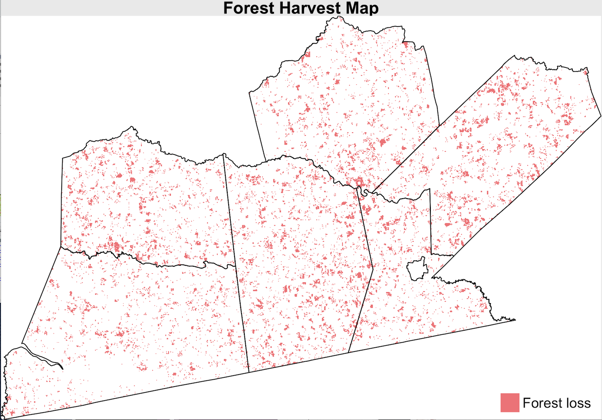
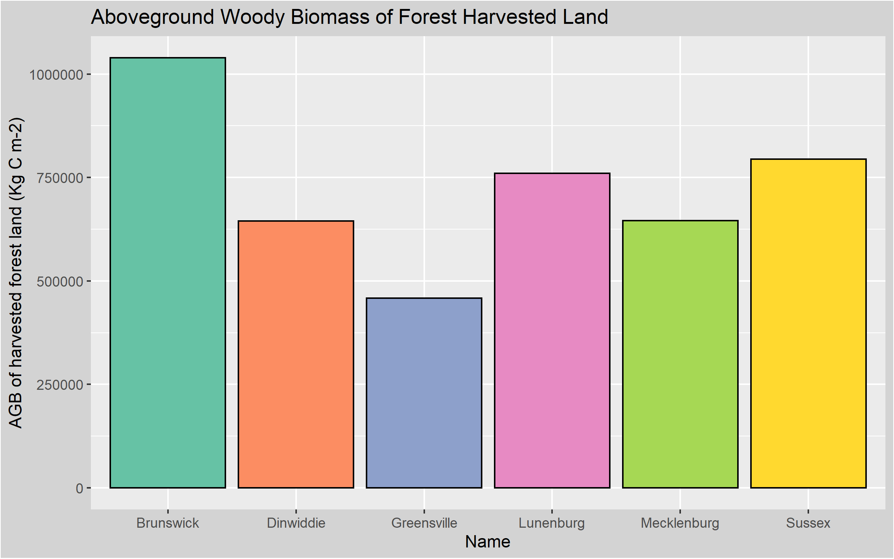
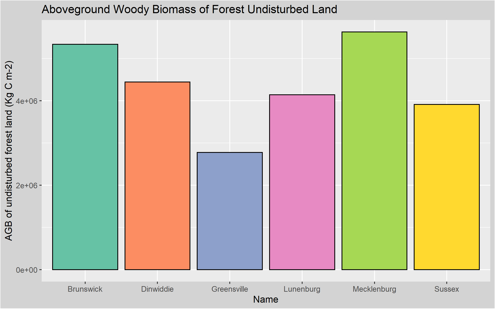

```{r setup, include = FALSE, message = FALSE}
# knitr::opts_chunk$set(echo = FALSE)
library(knitr)
library(deforestation)
```

### Introduction

- Forest is the largest terrestrial carbon sink stabilizing carbon storage on Earth. However, about 7-11 million square kilometers of natural forests have been deforested through agricultural expansion and timber harvest during the past 300 years. 
- Deforestation can affect a wide range of ecological functions, including carbon stocks and biomass accumulations.
- Therefore, in this study, we chose six counties in Southern Virginia to understand the connection among deforestation, carbon, and biomass because forest harvesting events are particularly common in forestland of Virginia. 

```{r,message = FALSE,echo=FALSE, out.width="50%"，fig.align='center'}

```

---
### Data and Methods 

#### Data
##### North American Forest Dynamics (NAFD) 
##### Forest Carbon Stocks and Fluxes After Disturbance, Southeastern USA, 1990-2010
##### National Aboveground Biomass and Carbon Baseline Dataset (NBCD, Version 2)


#### Methods
##### Quantifying forest harvest: Identify the pixels that belong to forest cover class in 1990 and then changed to non_forest cover class in 2000.

##### Comparing forest carbon stock change: 

##### Comparing forest biomass change: Biomass data were extracted from the datasets above and then Biomass were compared between 1990 and 2000 for all forest land, the forest harvested land, and the undisturbed land. 

##### Packages used: geospaar, dplyr, rgdal, raster, ggplot2, here, gridExtra, knitr, tmap, rastervis, mapview. 

---
### Results
#### Forest area change between 1990 and 2000

```{r,message = FALSE,echo=FALSE, out.width="45%"}




```

---
### Results
#### Forest area change between 1990 and 2000
```{r,message = FALSE,echo=FALSE, out.width="50%"}


```

---
### Results
#### Forest area change between 1990 and 2000

```{r,message = FALSE,echo=FALSE, out.width="50%"}


```

---
### Results
#### Comparing forest carbon stock change between 1990 and 2000

```{r,message = FALSE,echo=FALSE, out.width="50%"}

```

---
### Results
#### Comparing forest carbon stock change between 1990 and 2000

```{r,message = FALSE,echo=FALSE, out.width="50%"}

```

---
### Results
#### Comparing forest biomass change between 1990 and 2000
```{r,message = FALSE,echo=FALSE, out.width="40%"}


```

---
### Results
#### Comparing forest biomass change between 1990 and 2000
```{r,message = FALSE,echo=FALSE, out.width="50%"}



```

---
### Discussions 

- Overall, we learnt many new packages, functions, and coding tricks from completing this group project. For example, We learnt using the “here” package to locate our files relative to project root, and using the “gridExtra” package to arrange our data frame and draw tables. To save our result into the png format, we learnt using the “png” and “dev.off” function. We also used  “knitr::include_graphics” function in order to display our plots. Besides these important coding skills, we also learnt to cooperate and collaborate as a team in a completely remote manner. We found that Github makes remote teamwork much easier and more efficient.   

- Challenges: We had trouble while trying to rasterize our study area shapefile, resampling raster, building our project package, updating vignettes after changes, uploading large files (>100 MB) onto Github, and clearing git history. 

- Future implications: We would like to explore the time series trajectory of forest clearing, carbon stock, and biomass change based on all the datasets we have. We also want to learn more about the shiny and leaflet frameworks to display our project in a more user-friendly way.  

---
